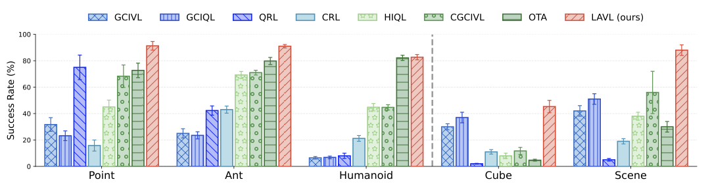

#  LAVL: Latent-Aliged Value Learning

The official implementation for \<Latent Representation Alignment for Offline Goal-Conditioned Reinforcement Learning\>

## Overview

<p align="center">
  
</p>

In offline GCRL, existing value-based methods often suffer from **erroneous value generalization**: the learned value function assigns similar values to states that are close in Euclidean distance, even when they are far apart in temporal distance.

We propose **Latent-Aligned Value Learning (LAVL)**, an offline GCRL algorithm built on a new value function architecture, **Latent Alignment Network (LAN)**. LAN parameterizes the goal-conditioned value as the negative distance between learned state and goal representations:

$V(s, g) = - \|\phi_S(s) - \phi_G(g)\|_2.$

This simple architecture significantly improves value generalization in offline GCRL!

## Requirements
Our code is based on the OGBench [1], a comprehensive benchmark for GCRL including baseline implementations.
The requirements and installation guide are presented in the OGBench [repository](https://github.com/seohongpark/ogbench/tree/master)

## Training
The implementation of LAVL algorithm is contained in the `impls/agents/lavl.py` file.
The hyperparameters and exact commands for reproduction are in the `impls/hyperparameters.sh` file.
For instance, the following command runs LAVL in antmaze-giant-navigate
```
python main.py --env_name=antmaze-giant-navigate-v0 --eval_episodes=50 --agent=agents/lavl.py --agent.discount=0.999 --agent.expectile=0.9 --agent.smoothness_weight=10.0 --agent.low_actor_rep_grad=True --agent.high_actor_rep_grad=True --agent.high_alpha=1.0 --agent.low_alpha=3.0 --agent.subgoal_steps=25
```

## Reference
[1] Park, S., Frans, K., Eysenbach, B., and Levine, S. OGBench: Benchmarking offline goal-conditioned RL. In The Thirteenth International Conference on Learning Representations, 2025.